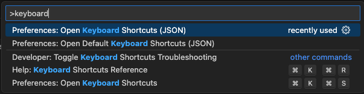

# VSCode IJKL keybindings
VSCode keybindings that allow you to navigate the code using IJKL instead of arrow keys.

### Installation
1. Open Command Palette (cmd+shift+p) and open `Keyboard Shortcuts (JSON)` 
2. Paste the contents of the `keybindindings.json` file to the newly opened config. This will override the default VSCode bindings

⚠️ Make sure you open the correct shortcuts file - the default shortcuts file is readonly! ⚠️

